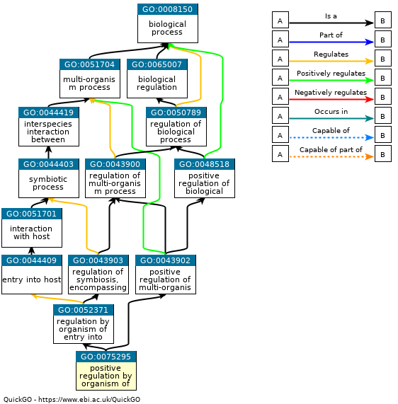

# Encode Gene Ontology terms using their definitions or positions on the GO tree.

### [This is our paper.](https://www.biorxiv.org/content/10.1101/765644v4)

## We apply the following methods to embed GO terms: 

* **Defintion encoder**
  1. BiLSTM 
  2. ELMo
  3. Transformer based on BERT strategy. 
  
* **Position encoder**
  1. GCN
  2. Onto2vec

### The key objective is to capture the relatedness of GO terms by encoding them into similar vectors. 

Consider the example below. We would expect child-parent terms to have similar vector embeddings; whereas, two unrelated terms should have different embeddings. Moreover, child-parent terms are in the same neighborhood, so that the position embeddings should also be the same. 

### Libraries needed

[pytorch](https://pytorch.org/),
[pytorch-pretrained-bert](https://pypi.org/project/pytorch-pretrained-bert/),
[pytorch-geometric](https://pytorch-geometric.readthedocs.io/en/latest/notes/installation.html)

### How to use Definition and Position encoder?

We embed the [definition](https://www.ebi.ac.uk/QuickGO/term/GO:0075295) of a term. The key is that child-parent terms often have simlar defintions, so that we can embed them into comparable vectors. 

All models are already trained, and ready to be used. **[You can download the embeddings here.](https://drive.google.com/drive/folders/129UObLlhnp0RK6MQAS7waUF-k4SuGV-u?usp=sharing)** There are different types of embeddings, you can try any of these embeddings. 

You can also use our trained model to produce vectors for any GO definitions, **[see example script here](https://github.com/datduong/EncodeGeneOntology/blob/master/DemoScript/TrainWriteGoDef.sh)**. You will have to prepare the **[go.obo definition input in this format here](https://drive.google.com/drive/u/1/folders/1DITbTYg_49lpDu_RmHzY5WVTG7Acp_7B)**. 

Alternatively, you can also train your own embedding by [following the same example script](https://github.com/datduong/EncodeGeneOntology/blob/master/DemoScript/TrainWriteGoDef.sh). You only need to prepare your [train/dev/test datasets into the same format here](https://drive.google.com/drive/folders/1DITbTYg_49lpDu_RmHzY5WVTG7Acp_7B?usp=sharing)

## Applications for Definition and Position encoders

### Compare functions of proteins

Almost every protein is annotated by a set of GO terms, for example see the [Uniprot database](https://www.uniprot.org/uniprot/?query=*&fil=organism%3A%22Homo+sapiens+%28Human%29+%5B9606%5D%22+AND+reviewed%3Ayes). 
Once you can express each GO term as a vector, then for any 2 proteins, you can compare the sets of terms annotating them. We used the Best-Match Average metric to compare 2 sets; however, there other options to explore. **[Our example to compare 2 proteins is here.](https://github.com/datduong/EncodeGeneOntology/blob/master/compare_set/FrontEndSoftware/Compare2Set.py)**

### Predict GO labels based on protein sequences

We can use [Uniprot database](https://www.uniprot.org/uniprot/?query=*&fil=organism%3A%22Homo+sapiens+%28Human%29+%5B9606%5D%22+AND+reviewed%3Ayes) to train a model that predicts GO labels for an unknown protein sequence. 

